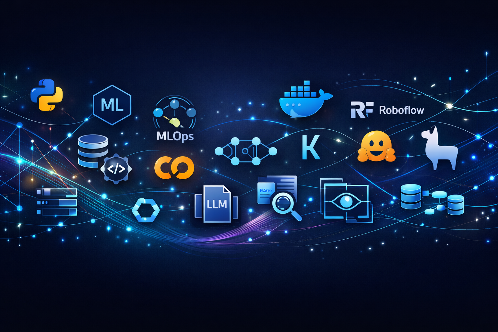

  

<h2 style="margin:0;">
🚀 Data & AI Engineer | Systems Background
</h2>

&nbsp;&nbsp;

  Construyendo soluciones basadas en datos e Inteligencia Artificial con foco en fiabilidad y escalabilidad.

  
  
  

---

## 💻 Sobre mí

- 🤖 Inmerso en aprendizaje continuo y exploratorio en IA aplicada: Machine Learning, NLP, LLMs, RAG y Computer Vision  
- 🔭 Desarrollando proyectos de Data Engineering y despliegue de modelos con APIs y Docker  
- 🧠 Background en sistemas e infraestructura, aportando visión de producción y escalabilidad  
- 🌱 Profundizando en MLOps, arquitecturas de datos y modelos en entornos reales  
- 👯 Abierto a colaborar en proyectos de IA aplicada y data pipelines  
- ⚡ Me motiva transformar ideas y pruebas de concepto en soluciones funcionales  

---

# 🛠️ Stack Tecnológico

Aquí algunas de las tecnologías con las que trabajo:

## 📊 Data & AI

---

## 🔗 APIs & Apps

---

## 🗄️ Databases

---

## ⚙️ Dev & Tools

---

# 🚀 Proyectos Destacados

| Proyecto | Descripción | Stack |
|-----------|------------|-------|
| 🤖 IA Generativa (LLMs / RAG) | POC/MVP para generación y procesamiento de contenido con modelos locales y APIs | Python · LangChain · Ollama · FastAPI · Docker |
| 🎯 Computer Vision | Detección de objetos en vídeo con modelos YOLO y generación de informes | PyTorch · OpenCV · Streamlit |
| 📦 Data Engineering ETL | Pipeline de ingestión y transformación de datos desde colas de mensajes a bases SQL/NoSQL | Python · SQL · MongoDB · Docker |

---

# 📊 GitHub Stats

---

## 🌐 Conecta conmigo

- 🔗 LinkedIn: [https://linkedin.com/in/TUPERFIL](https://linkedin.com/in/TUPERFIL)
- 💼 Portfolio: En construcción
- 📧 Email: alfbbt@gmail.com

---

⭐ Gracias por visitar mi perfil. Siempre abierto a colaborar en proyectos de IA y datos.
